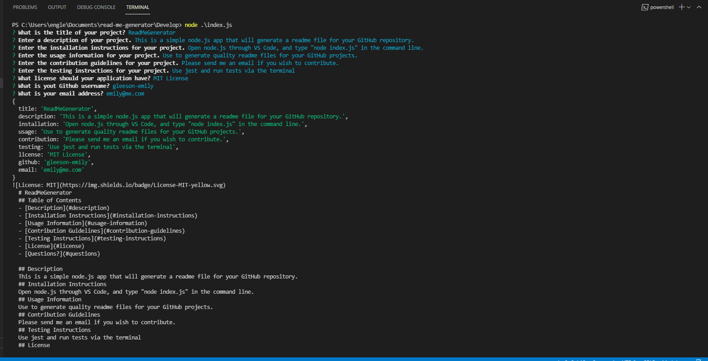

# Module 09 - README Generator

This is a simple README Generator built using node.js. 

The app uses the inquirer module as well as file system to provide the user with questions, then takes the responses to those questions and generates a Markdown file. The user's answers populate the fields in the Markdown file. Additionally, the table of contents contains links to each heading, so readers can easily jump to the section of the README that is relevant to them.

Please see the file [ReadMeGenerator.md](./Develop/ReadMeGenerator.md) in this repository for an example of a README produced through this program.

Screenshot of the answers being entered in the command line.

I've also made an example video which can be accessed [here](https://drive.google.com/file/d/1QiBMscu7F9Qztvh3c3woTHrPCH7YAbSi/view?usp=sharing).

Enjoy generating READMEs with this!